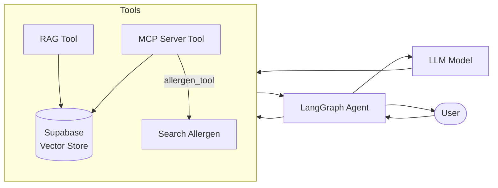

# Allergen MCP Server
MCP Server for checking food allergen.

This MCP server will be decorated with Langraph tool for AI agent

## System Architecture

## Features
- LangGraph Agent with ReAct reasoning
- MCP Server integration for allergen lookup
- RAG implementation with Supabase vector store
- Support for multiple LLM providers (OpenAI, Anthropic)

## Components
- **LangGraph Agent**: Orchestrates interactions between tools and LLM
- **MCP Server**: Provides allergen detection tool 
- **Supabase Vector Store**: Stores embeddings for allergen information
- **RAG Tool**: Enables semantic search across allergen data

Langgraph Tool agent is located in [agent/agent.py](agent/agent.py).

This repo has license implication

